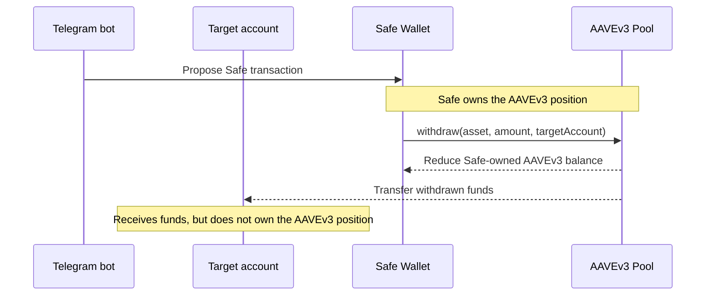

# ether.fi Telegram Top-Up Bot

Telegram bot that monitors configured users and starts the top-up flow when a target account needs attention.

## Top-Up Flow

The Safe Wallet owns the funds on AAVEv3. When the target account balance is
low, the bot proposes a Safe transaction that withdraws funds from AAVEv3 and
sends them directly to the target account.



Proposed Safe transaction:

| Field | Value |
| --- | --- |
| From | Safe Wallet |
| To | AAVEv3 Pool |
| Method | `withdraw(asset, amount, targetAccount)` |
| Recipient | Target account |
| Effect | Funds leave the Safe-owned AAVEv3 position and are sent to the target account |

## Setup

Create and activate a Python 3.12 virtual environment, then install the project:

```bash
python3.12 -m venv .venv
. .venv/bin/activate
pip install -e '.[dev]'
```

Copy `.env.example` to `.env` and set `BOT_TOKEN`, `BLOCKSCOUT_PRO_API_KEY`,
and `SAFE_TRANSACTION_SERVICE_API_KEY`:

```bash
cp .env.example .env
```

Before filling in `.env`:

- Create the Telegram bot with [BotFather](https://t.me/BotFather) and set `BOT_TOKEN` to the token it provides.
- Create the Safe wallet in [Safe](https://app.safe.global/) with at least one signer/owner and one proposer for the bot. Configure the bot with the proposer's private key, not a signer private key.
- Get `BLOCKSCOUT_PRO_API_KEY` from the [Blockscout Developer Portal](https://dev.blockscout.com/).
- Get `SAFE_TRANSACTION_SERVICE_API_KEY` from the [Safe Developer Portal](https://developer.safe.global/).

Configure allowed Telegram users in `data/config.json`. The bot only reacts to Telegram user IDs listed there. Each user also sets `balance_token_address`, which is the token checked for the target account balance.

To find a Telegram user ID, have the user send `/start` to the bot before they
are added to `data/config.json`, then check the bot logs for
`telegram_user_id=...`. Put that numeric ID in `users[].telegram_user_id`. If
the user should receive admin error notifications, also use that ID for
`admin_telegram_user_id`.

If the bot is not running, send a message to the bot and inspect Telegram
updates directly:

```bash
curl "https://api.telegram.org/bot$BOT_TOKEN/getUpdates"
```

## Balance Check Interval

Balance checks read Optimism token balances through Blockscout PRO API on chain id `10`.
Use `balance_check_interval_seconds >= 60` for 1-3 users on the Blockscout Free tier.
For larger user counts, see [docs/balance-check-interval.md](docs/balance-check-interval.md).

## Run

The current runtime uses Telegram polling:

```bash
.venv/bin/python -m etherfi_bot.runtime
```

Useful environment overrides:

- `CONFIG_PATH`: path to the JSON bot config, default `data/config.json`
- `STATE_DIR`: persisted FSM state directory, default `data/user_states`
- `POLLING_OFFSET_PATH`: persisted Telegram polling offset, default `data/polling_offset.json`
- `POLLING_PENDING_UPDATE_PATH`: pending Telegram update recovery file, default `data/polling_pending_update.json`
- `POLL_TIMEOUT_SECONDS`: Telegram long-poll timeout, default `25`
- `LOG_LEVEL`: runtime log level, default `INFO`
- `BLOCKSCOUT_PRO_API_KEY`: Blockscout PRO API key, required for balance checks

## Docker

Build the local image, then create the host state directory:

```bash
docker build -t akolotov/etherfi-telegram-topup-bot:latest .
mkdir -p bot-state
```

Docker runtime files stay outside the image. Provide `.env`, `data/config.json`,
and one proposer private key file per configured user, for example
`.secrets/safe_proposer_private_key_1001` and
`.secrets/safe_proposer_private_key_1002`. In `data/config.json`, set each
`safe_proposer_key_file` to that user's Compose secret path:

```json
"safe_proposer_key_file": "/run/secrets/safe_proposer_private_key_1001"
```

`safe_proposer_key_file` must contain the private key for the Safe proposer
configured for the bot. Do not use a Safe signer/owner private key here: the
proposer can submit transactions for signer review, while signer keys can
authorize Safe execution. Keeping signer keys out of the bot limits the impact
of a bot host compromise.

For each additional user, add a matching service secret and top-level secret in
`docker-compose.yml`, then point that user's `safe_proposer_key_file` at
`/run/secrets/<secret_name>`.

The container runs as UID/GID `1000`; make `bot-state` writable by that user on
Linux hosts.

Run the bot with Compose:

```bash
docker compose up -d
docker compose logs -f etherfi-topup-bot
docker compose down
```

## Test

```bash
.venv/bin/python -m pytest -q
```
